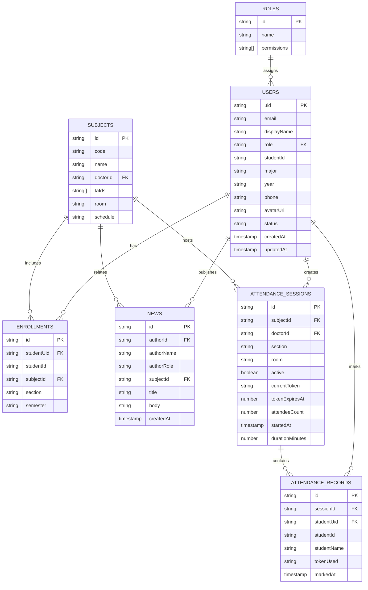

# CSIS Portal — Database ERD

## Entity Relationship Diagram

## Firestore Collections

| Collection | Document ID | Description |
|---|---|---|
| `users` | Firebase Auth UID | User profiles and roles |
| `subjects` | Subject slug (e.g. `cs341`) | Academic courses |
| `enrollments` | Auto ID | Student ↔ subject mapping |
| `news` | Auto ID | News feed items |
| `attendance_sessions` | Auto ID | Active QR sessions |
| `attendance_records` | Auto ID | Student attendance marks |
| `otp_codes` | Email (lowercase) | OTP verification codes |

## Indexes Required

- `news`: `createdAt` DESC
- `attendance_records`: composite `(sessionId, studentUid)`
- `attendance_sessions`: `doctorId`
- `users`: `email`
